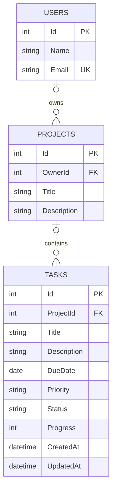

# Схема базы данных

OwnerId и ProjectId пока необязательны: CRUD задач работает без регистрации и проекта.
Удаление связанного пользователя или проекта запрещено, пока существуют ссылающиеся записи.
Приоритет: low, medium, high. Статус: todo, in_progress, completed.
Прогресс — целое число 0–100. API принимает 100 только для completed, и требует 100 при completed.
Title ограничен 150 символами, Description у задачи — 2000.
DueDate хранится как SQL date без часового пояса, CreatedAt и UpdatedAt — время UTC.
Идентификаторы генерирует SQL Server (IDENTITY). Email уникален.
Структура создаётся миграцией EF Core, а не при каждом запуске сервера.

