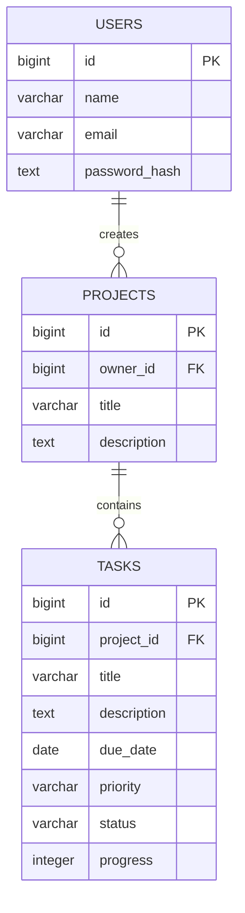

# База данных

На второй неделе подготовлены три основные сущности: пользователь, проект и задача.

На этом этапе CRUD реализован для задач. Поля `project_id` и `owner_id` пригодятся на следующих этапах, когда появятся проекты и авторизация.

